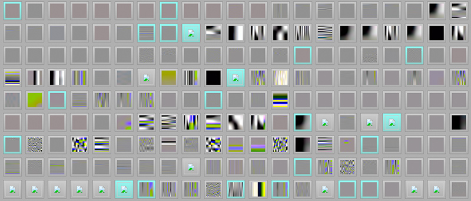

# AFL++
* Fuzzing or fuzz testing is an automated software testing technique
that involves providing invalid, unexpected, or random data as inputs
to a computer program.
    * The best part of AFL++ is that it can "figure out" what inputs might be
    useful for testing a program without relying much of developers' manual
    input.

* For example, given a program that takes JPEG images as input, we can
simply pass a "Hello" string to AFL++ and AFL++ can magically figure out
that the program's valid input is JPEG image.
    * These are some inputs generated by AFL++:

    

    For more info on this example, refer to [this link](https://lcamtuf.blogspot.com/2014/11/pulling-jpegs-out-of-thin-air.html)

* Install `apt install afl++`
    * `apt install gnuplot` for `afl-plot`

## Usage

* Check `Makefile`

## Output directory explained

```
ls ./output/ -alh
total 44K
drwxr-xr-x 5   4.0K Jun  6 14:32 .
drwxr-xr-x 5   4.0K Jun  6 14:26 ..
-rw------- 1     17 Jun  6 14:31 cmdline
drwx------ 2   4.0K Jun  6 14:31 crashes
-rw------- 1      4 Jun  6 14:32 .cur_input
-rw------- 1    776 Jun  6 14:32 fuzz_bitmap
-rw------- 1    171 Jun  6 14:31 fuzzer_setup
-rw------- 1    982 Jun  6 14:32 fuzzer_stats
drwx------ 2   4.0K Jun  6 14:31 hangs
-rw------- 1   1.3K Jun  6 14:32 plot_data
drwx------ 3   4.0K Jun  6 14:32 queue
```

* `crashes`: Inputs that crash the application being tested
    *
    ```
    ls ./output/crashes/ -alh
    total 72K
    drwx------ 2   4.0K Jun  6 14:31 .
    drwxr-xr-x 5   4.0K Jun  6 14:32 ..
    -rw------- 1      4 Jun  6 14:31 id:000000,sig:11,src:000000,time:0,op:flip1,pos:0
    -rw------- 1      4 Jun  6 14:31 id:000001,sig:04,src:000000,time:45,op:arith8,pos:0,val:-5
    -rw------- 1      4 Jun  6 14:31 id:000002,sig:06,src:000000,time:88,op:arith8,pos:2,val:+13
    -rw------- 1     32 Jun  6 14:31 id:000003,sig:04,src:000000,time:462,op:havoc,rep:8
    -rw------- 1     30 Jun  6 14:31 id:000004,sig:04,src:000000,time:654,op:havoc,rep:16
    -rw------- 1      3 Jun  6 14:31 id:000005,sig:04,src:000000,time:1936,op:havoc,rep:2
    -rw------- 1     26 Jun  6 14:31 id:000006,sig:04,src:000000,time:4686,op:havoc,rep:4
    -rw------- 1      6 Jun  6 14:31 id:000007,sig:06,src:000010,time:10929,op:arith8,pos:4,val:+13
    -rw------- 1      8 Jun  6 14:31 id:000008,sig:11,src:000012,time:12288,op:arith8,pos:2,val:+13
    -rw------- 1      8 Jun  6 14:31 id:000009,sig:11,src:000012,time:12299,op:arith8,pos:3,val:-5
    -rw------- 1     12 Jun  6 14:31 id:000010,sig:04,src:000012,time:12599,op:havoc,rep:2
    -rw------- 1     34 Jun  6 14:31 id:000011,sig:11,src:000022,time:16150,op:flip2,pos:4
    -rw------- 1      5 Jun  6 14:31 id:000012,sig:04,src:000011+000009,time:31209,op:splice,rep:2
    -rw------- 1     65 Jun  6 14:31 id:000013,sig:04,src:000021,time:33449,op:havoc,rep:16
    -rw------- 1     46 Jun  6 14:31 id:000014,sig:11,src:000022,time:44078,op:havoc,rep:16
    -rw------- 1    568 Jun  6 14:31 README.txt
    ```
    * `id`: crash id.
    * `sig`: exit signal the program gets when it crashed
    * etc.

* `hangs`: Inputs that hang the application being tested
* `queue`: Inputs that are going to be sent to the application

