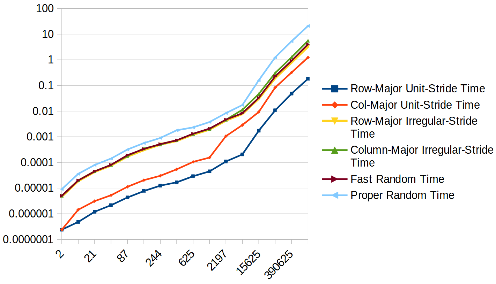
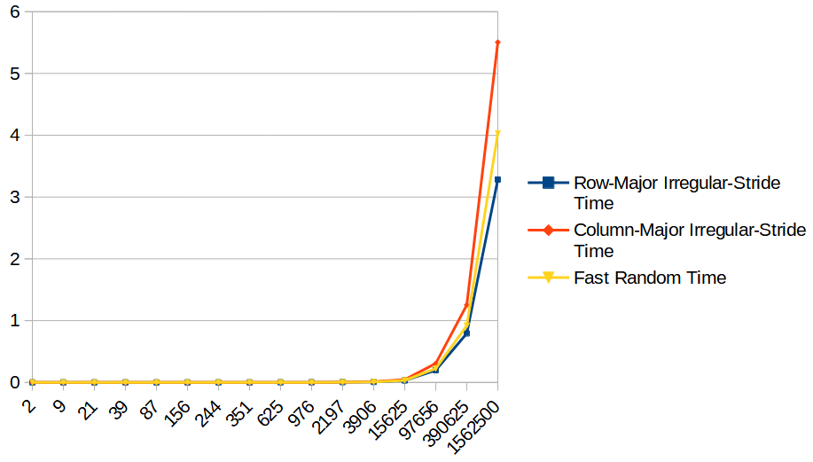
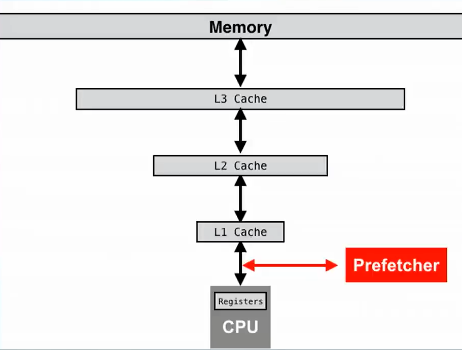

# Sequential and random memory access

- This is a continuation of [Row-major and column-major traversal](../03_row-and-column-major-traversal)

- Apart from row-major and column-major traversal, two loops that randomly access the 2d array are also added.

<table>
  <tr>
    <th>All-in-one (logarithmic)</th>
    <th>Random access only (linear)</th>
  </tr>
  <tr>
    <td></td>
    <td></td>
  </tr>
  <tr>
    <td colspan="2"><a href="./assets/results.csv">source</a></td>
  </tr>
</table>

- While RAM stands for random access memory, [results](./assets/results.csv) show that random-access is actually much
  slower (one to two orders of magnitude) than sequential access (i.e., row-major traversal).
  It is slower than traversal with a fixed stride (i.e., col-major traversal) as well.

- The reason is the [cache prefetching technology](https://en.wikipedia.org/wiki/Cache_prefetching).
  - Prefetchers proactively get data from main memory to cache before such data are needed. Prefetchers work the best
    if data access is very predictable--for exmaple, data are accessed sequentially.
  - Apart from prefetching very predictable data/instructions, some smarter prefetchers may try to prefetch
    based on simple patterns--such as irregular traversal strides. This could be the reason why row-major
    irregular-stride traversal is faster. (Cache line size may play a role as well, though)
  - In the second chart, one can still observe that row-major irregular-stride traversal can still outperform its
    counterparts by a coefficient.
    
