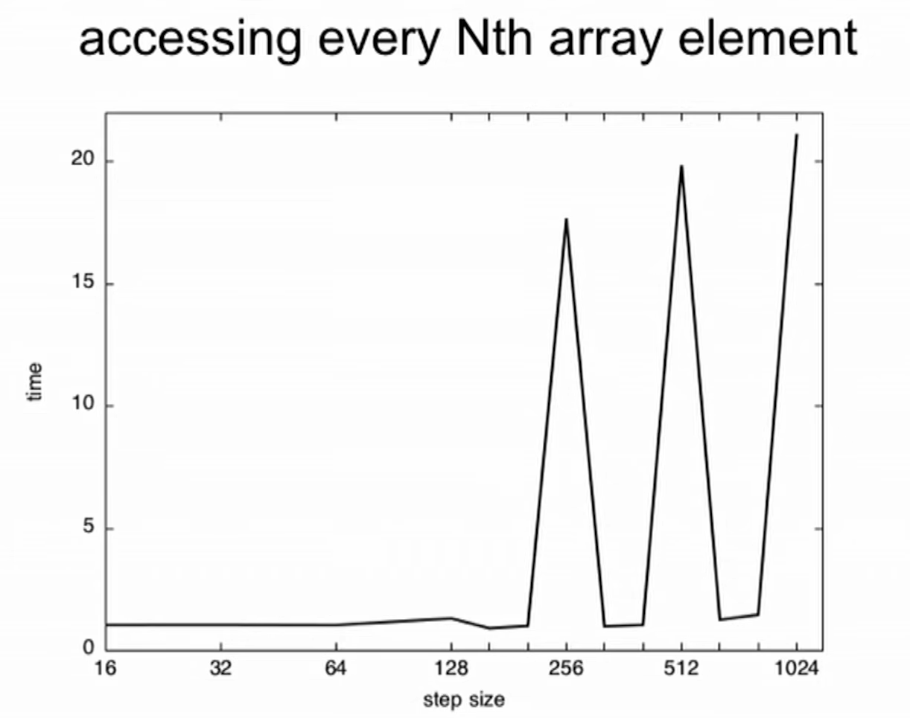
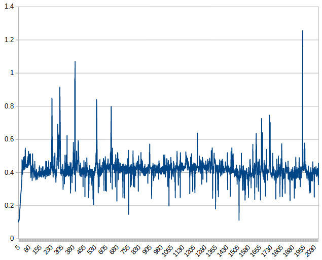

# Cache associativity

* The concept of cache associativity is that, say CPU wants to load a cache line from main memory from
cache memory, the cache line can only be stored in a few places of the cache, depending on its physicial address. 
A few informative videos explain this in a comprehensive manner:
  * [Introduction to Cache Memory](https://www.youtube.com/watch?v=Ez_kyBS-y5w)
  * [Direct Memory Mapping](https://www.youtube.com/watch?v=V_QS1HzJ8Bc)
  * [Associative Mapping](https://www.youtube.com/watch?v=uwnsMaH-iV0)
  * [Set Associative Mapping](https://www.youtube.com/watch?v=KhAh6thw_TI)
  * [Cache Memory Mapping - A Comparative Study](https://www.youtube.com/watch?v=e8RCnG2ibJk)

* The overall idea of this experiment is that, we iterate different step sizes and
when the step size is "just right" (usually a power of 2), cache memory will be saturated easily, dragging down
the performance a lot.
  * The expected result should be something like this shown by Timur Doumler:

    

  * This, unfortunately, is not the case:

    

* It is suspected that Intel's "address swizzling" technique (i.e., location in the cache
depends on a hash of the physical address and not the raw address) breaks the experiment. 

  * Intel discloses some of its internal design, such as the number of sets it uses
  for different levels of cache, in document like this one:
  [Intel® 64 and IA-32 Architectures Optimization Reference Manual](https://cdrdv2-public.intel.com/671488/248966_software_optimization_manual.pdf).
  * However, while users from [this post](https://stackoverflow.com/questions/74260504/why-i-cant-observe-the-effect-of-4-8-way-set-associative-cache-in-my-test-code/74261276?noredirect=1#comment131171636_74261276)
  mentioned about address swizzling, I failed to find a public Intel document that
  discloses how it is done. (Though a [patent application](https://patents.google.com/patent/US20150089183A1/en)

* This is yet another case as of why we should be extremely careful when formulating and theorizing optimization
techniques--general understanding on how things work could diverge so greatly from the reality that
it fails to achieve anything at all.
  * Benchmarking is always the way to go!