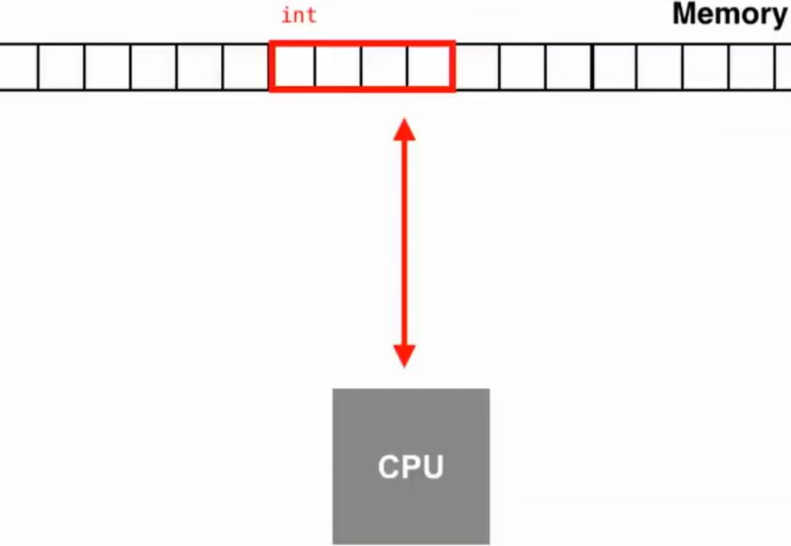
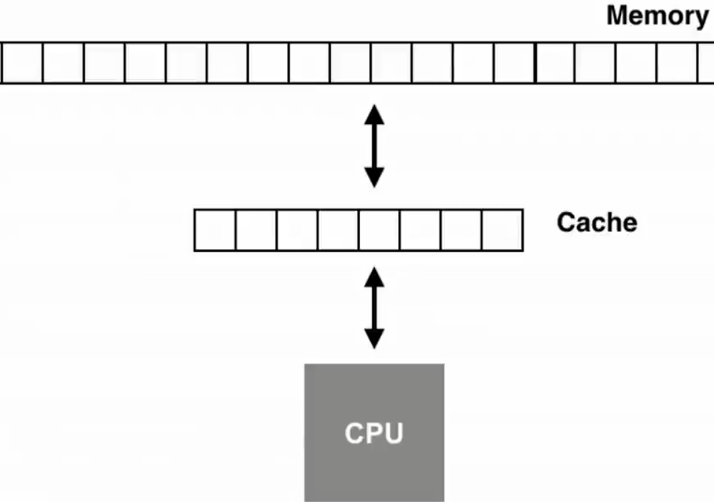
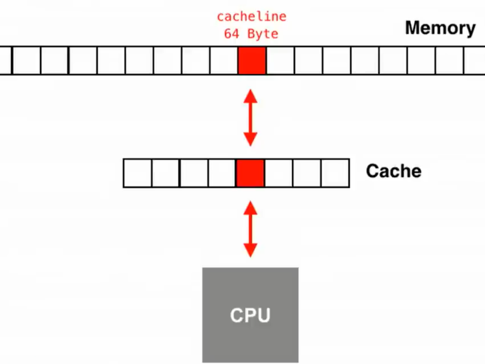
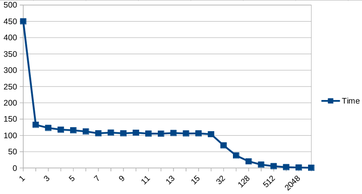
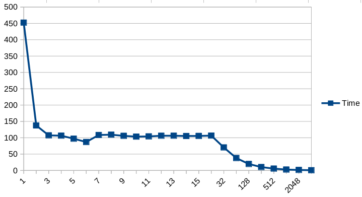
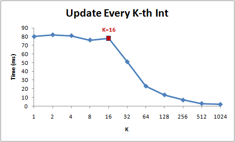

# Examine the size of cache line

## Introduction

* For programmers nowadays, the memory model is as simple as this:

(This is, well, actually not too bad, a lot of "programmers" may not even know an integer is 4-byte long 🤷🤷🤷.)

* For a few more "sophisticated" ones, they may be aware that between CPU and memory there are L1/L2/L3 caches,
which provides CPU with much faster data access.

|   Storage   | Latency | CPU Cycles (3GHz) |
| ----------- | ------- | ----------------- |
| Register    | 0.3ns   |  1                |
| L1 Cache    | ~1ns    |  3                |
| L2 Cache    | ~3ns    |  9                |
| L3 Cache    | ~10ns   |  30               |
| Memory      | ~100ns  |  300              |
| SSD         | ~100us  |  300,000          |
| HDD         | 1-10ms  |  eternity🤷       |

* There is one more technical detail which this experiment is going to touch upon.
Data are transferred between memory and cache in blocks of fixed size, called cache lines. Usually the size of
a cache line is 64 bytes.

## The experiment

* Can we `malloc()` some cache lines and use them as ordinary memory blocks? No, how data get in to or get out from
caches are controlled by hardware called the cache controller, such as one described
[here](https://developer.arm.com/documentation/den0024/a/Caches/Cache-controller). What a cache controller
does is largely transparent and there is usually no way for a program to explicity control it.

* Given the ultralow latency between CPU and L1 cache, the expected result is that the loop should take more or
less the same amount of time to complete before the step size reaches 16 (i.e. 64 bytes) and the time needed
after that should be halved each time step size is doubled. 

## Results

* My results

  * `gcc`:
  
  * `icc`:
  

* Results are roughly consistent with the expected--before 16, the amount of time needed is more or less stable and
after that the time needed is approximately halved as step size doubles.

* There is one significantly different pattern: when step size is close to 1 or 16, there are some significant 
fluctuations in both versions.

* (Failed) attempts to eliminate this unexpected pattern:
  * Try different computers, both virtual and physical ones--so that virtual machine won't complicate the issue.
  * Iterate each step size a few times--so that some random peaks will be smoothed out.
  * Simplify the calculation within the main loop--so that calculations won't be the bottleneck.
  * Disable vectorization and print out sample data--so that compilers can't just optimize my loop away.

* Other people results found online

  * From [Igoro Ostrovsky](http://igoro.com/archive/gallery-of-processor-cache-effects/):
   

  *  From [Timur Doumler](https://isocpp.org/blog/2017/05/cppcon-2016-want-fast-cpp-know-your-hardware-timur-doumler):
  
