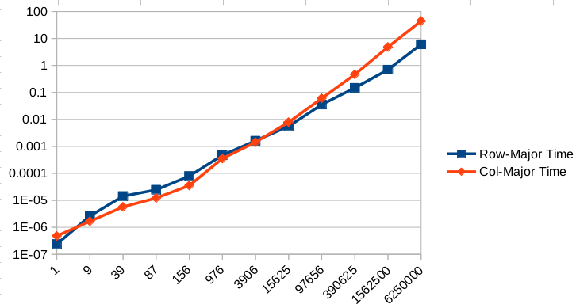

# Row-major and column-major traversal


## Introductions

* Prefering row-major rather than column-major traversal is a relatively common optimization
technique (well, at least on C and the sort of "C-series" languages like C++/Python/JavaScript/etc).
However, it is not really easy to properly design an experiment that demonstrate this:
* The most straightforward way to define a 2D array, `int arr[d][d]`, uses stack memory, which 
imposes significant restrictions on array size (no more than a few KB in many cases).
  * If the scale of the issue is limited to a few KB, row-major and column-major won't make a signficant difference
  anyway
* We may define the array by `int* arr = malloc(d * d * sizeof(int))` and access its element by `*(arr + i * d + j)`,
but it obfuscates our purpose of testing a two-dimensional array. Compilers may not be able to recognize the pattern as
2D array access, which could break the optimization.
* We may also define the 2D array by defining an array of pointers:
  ```
  int** arr = (int**)malloc(d * sizeof(int*));
  for (i = 0; i < d; i++)
    arr[i] = (int*)malloc(i * sizeof(int));
  ```
  However, it means that we only guarantee that each sub-array is contiguous and the entire 2d array is most likely
  separate, which is not really the same as `int arr[d][d]`
* In this project, we will take the second approach, `int* arr = malloc(d * d * sizeof(int))`

## Results

* 1st.c:

```
Dim,	ArraySize(KB),	Row-Major Time,	RM Sample,	Col-Major Time,	CM Sample
   10,	          0,	0.000000238,	      10,	 0.000000238,	       4
   20,	          1,	0.000000238,	      12,	 0.000000238,	      26
   50,	          9,	0.000003099,	      51,	 0.000001907,	      76
  100,	         39,	0.000016451,	     142,	 0.000006437,	     102
  150,	         87,	0.000029325,	     277,	 0.000014067,	     202
  200,	        156,	0.000094414,	     158,	 0.000041962,	     233
  500,	        976,	0.000541687,	     737,	 0.000405788,	     621
 1000,	       3906,	0.002210855,	    1733,	 0.002454519,	     944
 2000,	      15625,	0.007014275,	    1586,	 0.008472443,	    1876
 5000,	      97656,	0.041590452,	    2904,	 0.063577175,	    4090
10000,	     390625,	0.178899527,	    3067,	 0.330257177,	   11269
20000,	    1562500,	0.703771353,	   21851,	 4.094728708,	    9822
40000,	    6250000,	2.775997877,	   19084,	41.708540440,	   16050
```



// https://stackoverflow.com/questions/73891330/why-column-major-traversal-is-actually-faster-than-row-major-traversal-when-2d-a?noredirect=1#comment130472635_73891330