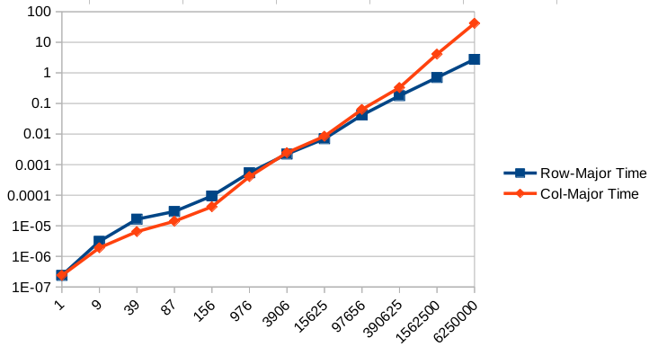

# Row-major and column-major traversal


## Introductions

* Prefering row-major rather than column-major traversal is a relatively common optimization
technique due to memory locality/vectorization/etc (well, at least in C and the sort of "C-series"
languages like C++/Python/JavaScript/etc). However, it is not really trival to properly design
an experiment that demonstrates this:
* The most straightforward way to define a 2D array, `int arr[d][d]`, uses stack memory, which 
imposes significant restrictions on array size (no more than a few KB in many cases).
  * If the scale of the issue is limited to a few KB, row-major and column-major won't make a signficant difference
  anyway
* We may define the array by `int* arr = malloc(d * d * sizeof(int))` and access its element by `*(arr + i * d + j)`,
but it obfuscates our purpose of testing a two-dimensional array. Compilers may not be able to recognize the pattern as
2D array access, which could break the optimization.
* We may also define the 2D array by defining an array of pointers:
  ```
  int** arr = (int**)malloc(d * sizeof(int*));
  for (i = 0; i < d; i++)
    arr[i] = (int*)malloc(i * sizeof(int));
  ```
  However, it means that we only guarantee that each sub-array is contiguous and the entire 2d array is most likely
  separate, which is not really the same as `int arr[d][d]`
* In this project, we will take the second approach, `int* arr = malloc(d * d * sizeof(int))`

## Results

### 1st.c

```
Dim,	ArraySize(KB),	Row-Major Time,	RM Sample,	Col-Major Time,	CM Sample
   10,	          0,	0.000000238,	      10,	 0.000000238,	       4
   20,	          1,	0.000000238,	      12,	 0.000000238,	      26
   50,	          9,	0.000003099,	      51,	 0.000001907,	      76
  100,	         39,	0.000016451,	     142,	 0.000006437,	     102
  150,	         87,	0.000029325,	     277,	 0.000014067,	     202
  200,	        156,	0.000094414,	     158,	 0.000041962,	     233
  500,	        976,	0.000541687,	     737,	 0.000405788,	     621
 1000,	       3906,	0.002210855,	    1733,	 0.002454519,	     944
 2000,	      15625,	0.007014275,	    1586,	 0.008472443,	    1876
 5000,	      97656,	0.041590452,	    2904,	 0.063577175,	    4090
10000,	     390625,	0.178899527,	    3067,	 0.330257177,	   11269
20000,	    1562500,	0.703771353,	   21851,	 4.094728708,	    9822
40000,	    6250000,	2.775997877,	   19084,	41.708540440,	   16050
```



* The results aren't totally expected--by theory, row-major traversal should always be faster than column-major
traversal, regardless of the array size.

* However, experiment results show that row-major traversal only outperforms
column-major one after array size grows beyond 1MB.

* [This question](https://stackoverflow.com/questions/73891330/why-column-major-traversal-is-actually-faster-than-row-major-traversal-when-2d-a?noredirect=1#comment130472635_73891330)
discussed this phenomenon in detail.

* Simply put, `malloc()` may return a pointer as soon as it promises to provide the requested memory but these memory
blocks may not be ready immediately after the pointer is returned. Memory blocks may only be ready right before they
are first accessed.

* As a result, we need to add a dummy loop which iterates over each element before we time row-major/column-major
traversal.

### 2nd.c

* The results are not consistent with the theory.

```
Dim,	ArraySize(KB),	Row-Major Time,	RM Sample,	Col-Major Time,	CM Sample
   10,	          0,	0.000000238,	      23,	 0.000000238,	        7
   20,	          1,	0.000000238,	      95,	 0.000000477,	       63
   50,	          9,	0.000001192,	     111,	 0.000003099,	      139
  100,	         39,	0.000003815,	    1987,	 0.000007391,	      867
  150,	         87,	0.000007629,	    2155,	 0.000015974,	      671
  200,	        156,	0.000012159,	     767,	 0.000040531,	    19967
  500,	        976,	0.000074387,	   33791,	 0.000223398,	    39039
 1000,	       3906,	0.000317574,	   95359,	 0.001656771,	      127
 2000,	      15625,	0.001822472,	   27647,	 0.008665562,	    87039
 5000,	      97656,	0.015828609,	12751391,	 0.070864916,	  3521183
10000,	     390625,	0.047500610,	 2266271,	 0.357491970,	 25610111
20000,	    1562500,	0.191143990,	25174512,	 4.814688206,	 32951814
40000,	    6250000,	0.883065224,	141508270,	66.746937513,	116683631
```


### 3rd.c

```
Dim,	ArraySize(KB),	Row-Major Time,	RM Sample,	Col-Major Time,	CM Sample,	 Difference
   10,	          0,	0.000000477,	00000064,	0.000000238,	00000063	0.000000238
   20,	          1,	0.000000238,	000000CC,	0.000000477,	000000E9	-0.000000238
   50,	          9,	0.000002623,	000001E4,	0.000004292,	000001A0	-0.000001669
  100,	         39,	0.000007153,	00000404,	0.000013590,	00000456	-0.000006437
  200,	        156,	0.000033617,	00000813,	0.000052214,	0000080F	-0.000018597
  500,	        976,	0.000193119,	0000109D,	0.000506163,	00001277	-0.000313044
 1000,	       3906,	0.000669003,	00002733,	0.002027988,	00002CC8	-0.001358986
 2000,	      15625,	0.002665043,	00004718,	0.010874033,	00005AF8	-0.008208990
 5000,	      97656,	0.020594120,	00001C6B,	0.083381653,	00001DF4	-0.062787533
10000,	     390625,	0.063822746,	0000746C,	0.712324858,	00007380	-0.648502111
20000,	    1562500,	0.295757532,	0000A456,	6.908070564,	000059CD	-6.612313032
```

