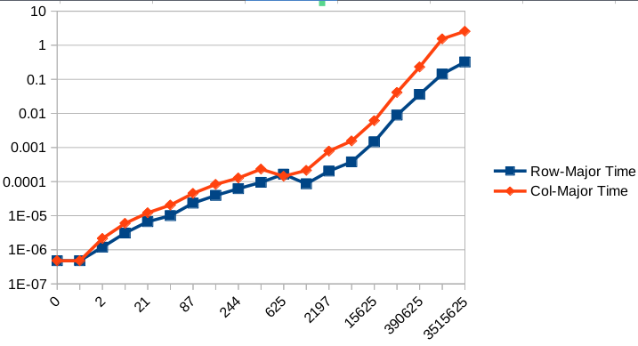

# Row-major and column-major traversal


## Introductions

* Prefering row-major over column-major traversal is a relatively common optimization
technique due to memory locality/vectorization/etc (well, at least in C and the sort of "C-series"
languages like C++/Python/JavaScript/etc). However, it is not really trival to properly design
an experiment that demonstrates this:
* The most straightforward way to define a 2D array, `int arr[d][d]`, uses stack memory, which 
imposes significant restrictions on array size (no more than a few KB in many cases).
  * If the scale of the issue is limited to a few KB, row-major and column-major won't make a signficant difference
  anyway
* We may define the array by `int* arr = malloc(d * d * sizeof(int))` and access its element by `*(arr + i * d + j)`,
but it obfuscates our purpose of testing a two-dimensional array. Compilers may not be able to recognize the pattern as
2D array access, which could break the optimization.
* We may also define the 2D array by defining an array of pointers:
  ```
  int** arr = (int**)malloc(d * sizeof(int*));
  for (i = 0; i < d; i++)
    arr[i] = (int*)malloc(i * sizeof(int));
  ```
  However, it means that we only guarantee that each sub-array is contiguous and the entire 2d array is most likely
  separate, which is not really the same as `int arr[d][d]`
* In this project, we will take the second approach, `int* arr = malloc(d * d * sizeof(int))`

## Results

### 1st.c

```
Dim,	ArraySize(KB),	Row-Major Time,	RM Sample,	Col-Major Time,	CM Sample
   10,	          0,	0.000000238,	      10,	 0.000000238,	       4
   20,	          1,	0.000000238,	      12,	 0.000000238,	      26
   50,	          9,	0.000003099,	      51,	 0.000001907,	      76
  100,	         39,	0.000016451,	     142,	 0.000006437,	     102
  150,	         87,	0.000029325,	     277,	 0.000014067,	     202
  200,	        156,	0.000094414,	     158,	 0.000041962,	     233
  500,	        976,	0.000541687,	     737,	 0.000405788,	     621
 1000,	       3906,	0.002210855,	    1733,	 0.002454519,	     944
 2000,	      15625,	0.007014275,	    1586,	 0.008472443,	    1876
 5000,	      97656,	0.041590452,	    2904,	 0.063577175,	    4090
10000,	     390625,	0.178899527,	    3067,	 0.330257177,	   11269
20000,	    1562500,	0.703771353,	   21851,	 4.094728708,	    9822
40000,	    6250000,	2.775997877,	   19084,	41.708540440,	   16050
```


* The results aren't totally expected--by theory, row-major traversal should always be faster than column-major
traversal, regardless of the array size.

* However, experiment results show that row-major traversal only outperforms
column-major one after array size grows beyond 1MB.

* Without digging deep into the internals of `malloc()` and other software/hardware components, there are a few
possible explanations:
  0. `malloc()` may return a pointer as soon as it promises to provide the requested memory but these memory
blocks may not be ready immediately after the pointer is returned. Memory blocks may only be ready right before they
are first accessed.
  0. Caching: since both traversals share the same memory blocks, if we run row-major traversal first and then col-major
  traversal, it is possible that OS/hardware caches memory blocks before second loop, benefiting column-major traversal.
  0. out-of-order execution: in `1st.c`, each iteration is independent from each other, meaning that the order of execution
  doesn't really matter. As a result, if compliers/CPUs are smart enough, they can optimize the difference between
  row-major and column-major traversals away without impacting the final result.


### 2nd.c

* We added a dummy loop which iterates over each element before we time row-major/column-major
traversal, which can presumably avoid the first two possible issues.
* The results are now consistent with the theory.

```
Dim,	ArraySize(KB),	Row-Major Time,	RM Sample,	Col-Major Time,	CM Sample,	Diff
    5,	          0,	0.000000477,	       2,	 0.000000477,	        2,	0.000000000
   10,	          0,	0.000000477,	       2,	 0.000000477,	        2,	0.000000000
   25,	          2,	0.000001192,	     114,	 0.000002146,	       22,	0.000000954
   50,	          9,	0.000003099,	     735,	 0.000005960,	      896,	0.000002861
   75,	         21,	0.000006676,	    1034,	 0.000012159,	      551,	0.000005484
  100,	         39,	0.000010014,	    5474,	 0.000020504,	     5766,	0.000010490
  150,	         87,	0.000023365,	     413,	 0.000045061,	      367,	0.000021696
  200,	        156,	0.000039339,	   28544,	 0.000082731,	      518,	0.000043392
  250,	        244,	0.000061989,	    1080,	 0.000127554,	      804,	0.000065565
  300,	        351,	0.000095367,	   44460,	 0.000232220,	      864,	0.000136852
  400,	        625,	0.000165224,	    6400,	 0.000143766,	    62971,	-0.000021458
  500,	        976,	0.000085831,	    7916,	 0.000213623,	    76166,	0.000127792
  750,	       2197,	0.000203371,	     850,	 0.000786066,	    16789,	0.000582695
 1000,	       3906,	0.000380039,	  443701,	 0.001558542,	   153053,	0.001178503
 2000,	      15625,	0.001464605,	 3285368,	 0.006115913,	  2148875,	0.004651308
 5000,	      97656,	0.008935690,	15035404,	 0.041233063,	 18812177,	0.032297373
10000,	     390625,	0.036279678,	15794189,	 0.230574131,	 13503371,	0.194294453
20000,	    1562500,	0.143177509,	18243515,	 1.536632299,	 31540927,	1.393454790
30000,	    3515625,	0.322322369,	94081292,	 2.566803217,	 52621379,	2.244480848
```



### 3rd.c

* `2nd.c`'s results are largely consistent with the theory. However, it can't answer the question we raised in `1st.c`:
`malloc()` or caching, which breaks the assumption?
* `3rd.c` is designed to answer this by accessing the first and last elements only. The argument is that, if we access
the beginning and the end of the contiguous memory, most likely that `malloc()` has to make all blocks available.
* As a result, if it is `malloc()` that causes the inconsistency in `1st.c`, such inconsistency shall disappear.
* Results show that the inconsistency persists, implying that `malloc()` shouldn't be the cause of the issue.

```
Dim,	ArraySize(KB),	Row-Major Time,	RM Sample,	Col-Major Time,	CM Sample,	Diff
    5,	          0,	0.000000477,	       5,	 0.000000477,	       19,	0.000000000
   10,	          0,	0.000000954,	      17,	 0.000000715,	       35,	-0.000000238
   25,	          2,	0.000001669,	      45,	 0.000003099,	      215,	0.000001431
   50,	          9,	0.000005245,	      80,	 0.000006914,	      538,	0.000001669
   75,	         21,	0.000029325,	     111,	 0.000014067,	      391,	-0.000015259
  100,	         39,	0.000036240,	     158,	 0.000023603,	     1880,	-0.000012636
  150,	         87,	0.000112534,	    4560,	 0.000051260,	      734,	-0.000061274
  200,	        156,	0.000337839,	     293,	 0.000096560,	    14128,	-0.000241280
  250,	        244,	0.000210524,	   11179,	 0.000149250,	    10876,	-0.000061274
  300,	        351,	0.000744343,	     247,	 0.000267982,	    16516,	-0.000476360
  400,	        625,	0.001317739,	     478,	 0.000439882,	     9575,	-0.000877857
  500,	        976,	0.001770735,	     815,	 0.000656366,	   145634,	-0.001114368
  750,	       2197,	0.004037857,	     783,	 0.002784014,	    77879,	-0.001253843
 1000,	       3906,	0.006388903,	    1009,	 0.004082203,	   377852,	-0.002306700
 2000,	      15625,	0.012204409,	    2346,	 0.006701231,	   135260,	-0.005503178
 5000,	      97656,	0.031680346,	    8797,	 0.040422440,	  8824393,	0.008742094
10000,	     390625,	0.115923166,	   11434,	 0.228796005,	  8241199,	0.112872839
20000,	    1562500,	0.398369312,	   22115,	 1.595250368,	 19100277,	1.196881056
30000,	    3515625,	0.926626444,	   21905,	 2.828975439,	119918101,	1.902348995

```


### 4th.c

* `4th.c` is designed to test the 2nd hypothesis by `malloc()`ing different memory to two loops so that even if
the first loop caches data, it will not benefit the second loop.
* The results are similar to `2nd.c`, implying that it is more likely that CPU caching is what causes the program
to behave unexpectedly.

```
Dim,	ArraySize(KB),	Row-Major Time,	RM Sample,	Col-Major Time,	CM Sample,	Diff
    5,	          0,	0.000000477,	       4,	 0.000000477,	        0,	0.000000000
   10,	          0,	0.000000715,	       5,	 0.000000477,	        7,	-0.000000238
   25,	          2,	0.000000954,	      23,	 0.000001669,	       27,	0.000000715
   50,	          9,	0.000006199,	      41,	 0.000012398,	       42,	0.000006199
   75,	         21,	0.000007391,	      48,	 0.000029325,	       67,	0.000021935
  100,	         39,	0.000010252,	     111,	 0.000058889,	      107,	0.000048637
  150,	         87,	0.000024080,	      93,	 0.000159264,	      182,	0.000135183
  200,	        156,	0.000197411,	     294,	 0.000281811,	      309,	0.000084400
  250,	        244,	0.000280142,	     455,	 0.000463486,	      288,	0.000183344
  300,	        351,	0.000346184,	     362,	 0.000595331,	      247,	0.000249147
  400,	        625,	0.000205278,	     726,	 0.000358820,	      418,	0.000153542
  500,	        976,	0.000321150,	     291,	 0.000567675,	      379,	0.000246525
  750,	       2197,	0.000747442,	     802,	 0.001641989,	      598,	0.000894547
 1000,	       3906,	0.000935793,	     758,	 0.002532244,	     1206,	0.001596451
 2000,	      15625,	0.002561808,	    2392,	 0.008083582,	     2145,	0.005521774
 5000,	      97656,	0.013834000,	    6951,	 0.061349869,	     8017,	0.047515869
10000,	     390625,	0.045639992,	   10965,	 0.203283787,	    11688,	0.157643795
20000,	    1562500,	0.150446892,	   19252,	 1.266974449,	    21026,	1.116527557
30000,	    3515625,	0.338406086,	    4745,	 2.406289339,	    31243,	2.067883253

```


### Miscellaneous

* How about the tiny drop at around 1MB? My guess is that it is relevant to L1 cache, which is also 1MB in size.
* How about the out-of-order execution? It seems to me that compilers aren't as smart as we think. OOO execution
does not appears to be the cause of the issue. It may, however, cause issues when we
[test the size of cache lines](../2_cache-line) though.