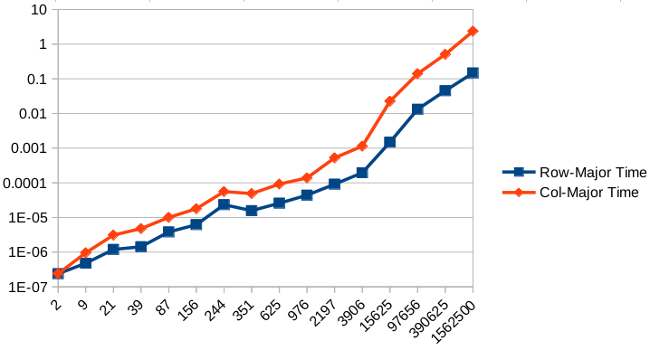
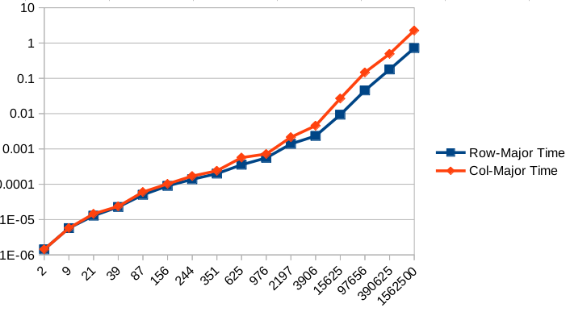
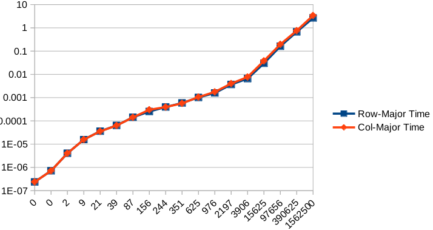

# CPU-bound vs memory-bound

* This is a continuation of [Row-major and column-major traversal](../3_row-and-column-major-traversal) 

* Results are as follows:

<table>
  <tr>
    <th>addition</th>
    <th>sqrt()</th>
    <th>sqrt() * sqrt() / sqrt()</th>    
  </tr>
  <tr>
    <td></td>
    <td></td>
    <td></td>
  </tr>
  <tr>
    <td><a href="./assets/1st-results.csv">Source</a></td>
    <td><a href="./assets/2nd-results.csv">Source</a></td>
    <td><a href="./assets/3rd-results.csv">Source</a></td>
  </tr>
</table>

* One can observe that as programs involve heavier calculation, the performance gap between 
row-major and column-major traversal appears later then totally disappears.

* The reason behind the observation is that:
  * if calculation is very light, even L1 cache won't be fast enough to feed data to CPU on time. All iterations are
  memory-bound, meaning that memory I/O is the bottleneck of the overall performance. As a result, row-major
  can outperform column-major traversal since the very beginning.
  * as calculation becomes heavier and heavier, first, L1 cache, then L2, L3 caches and finally memory itself, can
  feed data fast enough to CPU (as CPU needs a lot of time to calculate). The program becomes more and more
  CPU-bound, the memory I/O advatange of row-major traversal becomes less and less significant, until totally fades away.

* The major lesson of the experiment is that, as too many components (e.g., CPU, memory, hard drive, OS, compiler, etc)
are moving simultaneously, theoretical performance gain can't be simply assumed. One should always profile the
program to be sure on whether or not an optimization technique actually works.