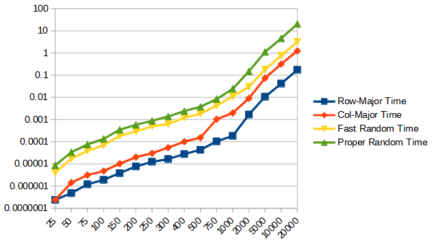

# Sequential and random memory access

* This is a continuation of [Row-major and column-major traversal](../3_row-and-column-major-traversal) 

* Apart from row-major and column-major traversal, two loops that randomly access the 2d array are also added.

* Results show that random-access is even slower than column-major traversal.

* The reason is prefetcher.