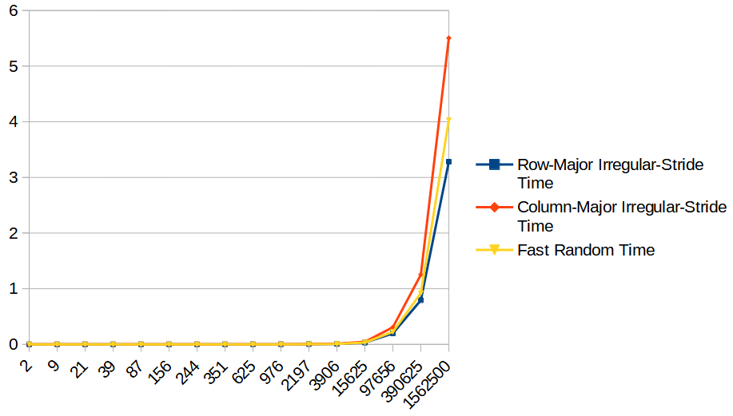
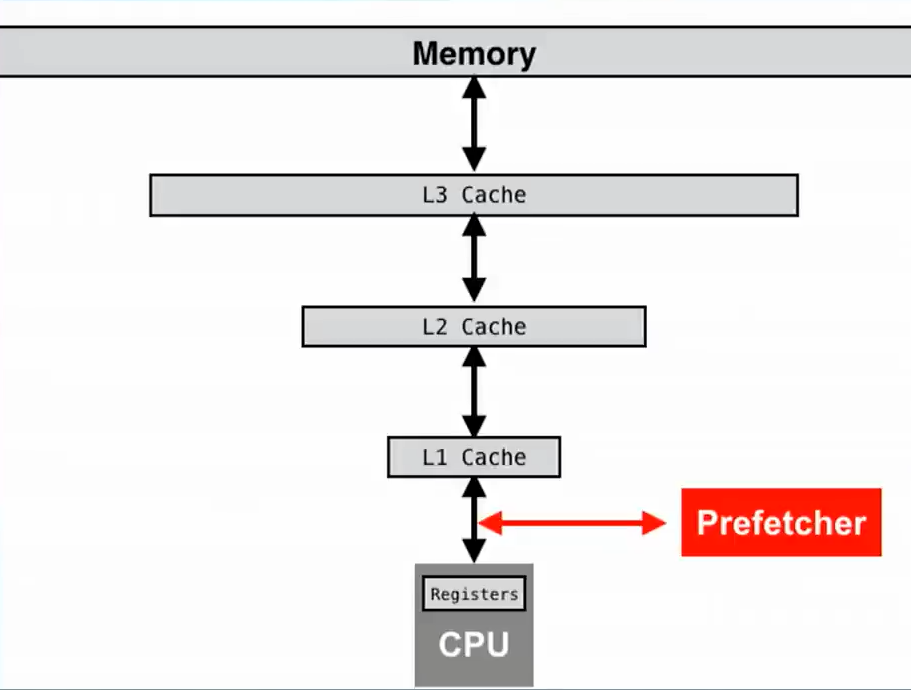

# Sequential and random memory access

* This is a continuation of [Row-major and column-major traversal](../3_row-and-column-major-traversal) 

* Apart from row-major and column-major traversal, two loops that randomly access the 2d array are also added.

<table>
  <tr>
    <th>All-in-one (logarithmic)</th>
    <th>Random access only (linear)</th>
  </tr>
  <tr>
    <td></td>
    <td></td>
  </tr>
  <tr>
    <td colspan="2"><a href="./assets/results.csv">source</a></td>
  </tr>
</table>

* [Results](./assets/results.csv) show that random-access is even slower than column-major traversal.

* The reason is the [cache prefetching technology](https://en.wikipedia.org/wiki/Cache_prefetching).

  * Apart from prefetching very predictable data/instruction, some smarter prefetchers may try to prefetch based on some
  simple patterns.
  * In the second chart, one can still observe that row-major irregular-stride traversal can still outperform its
  counterparts by a coefficient.