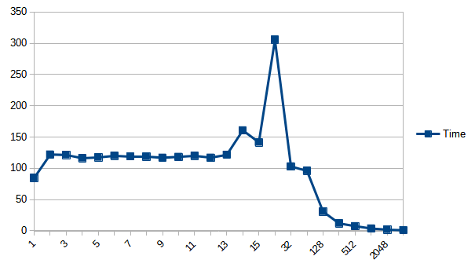

# Examine the size of cache line

* Data are transferred between memory and cache in blocks of fixed size, called cache lines. Usually the size of
a cache line is 64 bytes.

* Running the code, the expected result is that the loop should take more or less the same amount of time to
complete before the step size reaches 16 (i.e. 64 bytes) and the time needed after that should be halved each
time step size is doubled. 

## Results

* My results

  * `gcc`:
  
  * `icc`:
  

* Results are roughly consistent with the expected--before 16, the amount of time needed is more or less stable and
after that the time needed is approximately halved as step size doubles.

* There is one significantly different pattern: when step size is close to 1 or 16, there are some significant 
fluctuations in both versions.

* (Failed) attempts to eliminate this unexpected pattern:
  * Try different computers, both virtual and physical ones--so that virtual machine won't complicate the issue.
  * Iterate each step size a few times--so that some random peaks will be smoothed out.
  * Simplify the calculation within the main loop--so that calculations won't be the bottleneck.
  * Disable vectorization and print out sample data--so that compilers can't just optimize my loop away.

* Other people results found online

  * From [Igoro Ostrovsky](http://igoro.com/archive/gallery-of-processor-cache-effects/):
   

  *  From [Timur Doumler](https://isocpp.org/blog/2017/05/cppcon-2016-want-fast-cpp-know-your-hardware-timur-doumler):
  