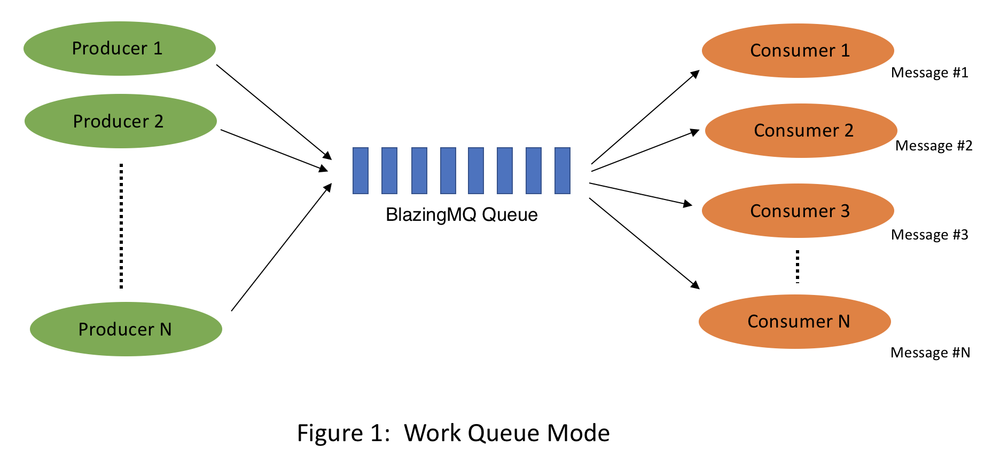
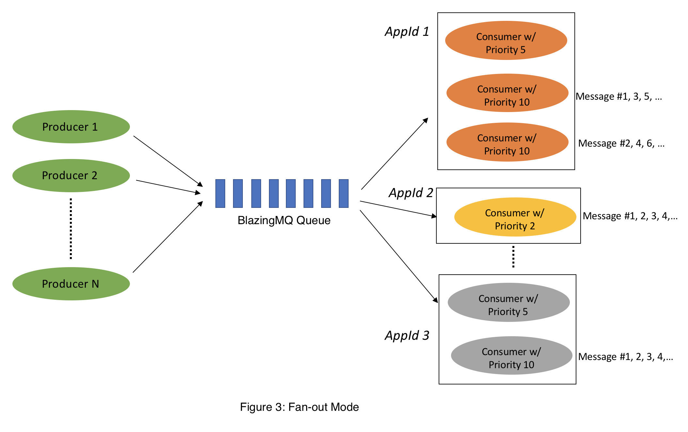

# Pointer Series: Ep. 3 - `std::shared_ptr` (and `std::weak_ptr`)

- `std::shared_ptr` is a smart pointer that retains shared ownership of an
  object through a pointer. Several shared_ptr objects may own the same
  object [[1](https://en.cppreference.com/w/cpp/memory/shared_ptr)] through
  sharing a resource
  counter[[2](https://courses.cs.washington.edu/courses/cse390c/24wi/lectures/smart.pptx)]:
    - Copy construction and copy assignment (operator=) will increment the
      counter
    - Destructor will decrement the counter

- The ownership of an object can only be shared with another shared_ptr by copy
  constructing or copy assigning its value
  to another shared_ptr. Constructing a new shared_ptr using the raw underlying
  pointer owned by another shared_ptr
  leads to undefined
  behavior [[3](https://en.cppreference.com/w/cpp/memory/shared_ptr)].

- shared_ptr objects replicate a limited pointer functionality by providing
  access to the object they point to through
  operators * and ->. For safety reasons, they do not support pointer
  arithmetics [[4](https://cplusplus.com/reference/memory/shared_ptr/)].

## Use case

- As usually we prefer a single ownership design, `std::shared_ptr` is way
  less widely used than `std::unique_ptr`. One practical example where
  `std::shared_ptr` can help is the producer-consumer queue pattern. Note that
  for SPMC/MPMC queue there exists multiple common patterns:

    - The round-robin
      pattern, which is typically used for
      load-balancing [[5](https://bloomberg.github.io/blazingmq/docs/features/message_routing_strategies/#work-queue)]:

      

    - fan-out pattern/broadcast
      pattern[[6](https://bloomberg.github.io/blazingmq/docs/features/message_routing_strategies/#broadcast-mode)] ,
      which is typically used to duplicate messages for multiple consumers.
      (Note that this illustration is a bit more advanced--it supports fan-out
      by AppId. so it is round-robin pattern within fan-out pattern to achieve
      both load-balancing as well as duplication.)

      

- [3_pcqueue-pattern.cpp](./3_pcqueue-pattern.cpp) demonstrates how we leverage
  `std::shared_ptr` to implement the fan-out/broadcast pattern

## `std::weak_ptr`

- As `std::shared_ptr` leverages reference counting, as demonstrated
  in [3_shared-ptr-demo.cpp](./3_shared-ptr-demo.cpp), two `shared_ptr` objects
  could lead to a reference cycle, which will cause memory leak.

- To alleviate such pitfall, `std::weak_ptr` is introduced. `std::weak_ptr` is a
  smart pointer that holds a non-owning ("weak") reference to an object that is
  managed by `std::shared_ptr`. It must be converted to std::shared_ptr in order
  to access the referenced
  object. [[7](https://en.cppreference.com/w/cpp/memory/weak_ptr)]

    - We use `std::weak_ptr::lock()` to convert a weak pointer to a shared
      pointer (if the object is still alive). If the object has already been
      deleted, `lock()` returns an empty shared
      pointer. [[8](https://en.cppreference.com/w/cpp/memory/weak_ptr/lock)]
    - Can you feel it? `std::weak_ptr` is a bit like raw pointer but with
      additional safety.

- `std::weak_ptr` could be useful when we want to implement an observer pattern.
  C# has an official implementation as well as
  documentation [here](https://learn.microsoft.com/en-us/dotnet/standard/events/observer-design-pattern)
  on the observer pattern here.

    - Or if you believe that talk is cheap, here is the
      code: [3_observer-pattern.cpp](./3_observer-pattern.cpp)