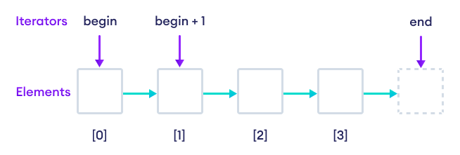
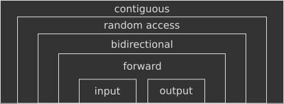

# Iterators

- Iterators are one of the four pillars of the Standard Template Library or STL
  in C++. (the remaining three being algorithms, containers and functors (aka
  function
  objects)) [[Iterator in C++](https://www.wscubetech.com/resources/cpp/iterator)]

- An iterator is a pointer-like object representing an element's position in a
  container. It is used to iterate over elements in a
  container. [[C++ Iterators](https://www.programiz.com/cpp-programming/iterators)]

    - Concretely, an iterator is a simple class that provides a bunch of
      operators: increment ++, dereference \* and few others which make it very
      similar to a pointer and the arithmetic operations you can perform on it.

      

- Modern C++ defines six types, with later types build upon earlier types:

    1. Input Iterator: Can scan the container forward only once, can't change
       the value it points to (read-only);
    2. Output Iterator: Can scan the container forward only once, can't read the
       value it points to (write-only);
    3. Forward Iterator: Can scan the container forward multiple times, can read
       and write the value it points to;
    4. Bidirectional: Iterator Same as previous one but can scan the container
       back and forth;
    5. Random Access: Iterator Same as previous one but can access the container
       also non-sequentially (i.e. by jumping around);
    6. Contiguous Iterator: Same as previous one, with the addition that
       logically adjacent elements are also physically adjacent in memory.

- Note that to have `rbegin()` and `rend()` methods, the container must
  implement "reverse_iterator". "reverse_iterator" is not a standalone type, it
  is just forward_iterator but goes
  backwards [[Can I convert a reverse iterator to a forward iterator?](https://stackoverflow.com/a/2038101/19634193)]
